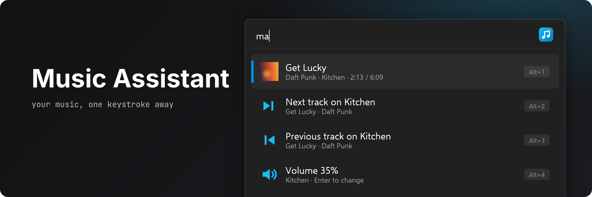

<!-- generated by readwright from docs/README.md.j2; edit the template, not this file -->

# Music Assistant for Flow Launcher

Search, play and control Music Assistant from Flow Launcher.

  

 

## Features

* **Search everything.** Tracks, albums, artists, playlists, radio, podcasts and audiobooks from your library and your streaming providers.
* **What's playing.** Type `ma` to see the current track, skip it, change the volume or switch players.
* **Pick the speaker.** Choose which player or group gets the music. The plugin remembers it.
* **Shift+Enter for more.** Play a result next, add it to the queue, start a radio from it or send it to another player.
* **Podcasts and audiobooks.** Browse episodes, and pick up half-finished episodes and books where you left off.

## Setup

1. Install the plugin as described under [Installation](#installation).
2. In Music Assistant, open **Settings**, then your profile, and create a **long-lived token**. Copy it.
3. In Flow Launcher, open **Settings > Plugins > Music Assistant** and fill in:
   * **Server URL**: the address you open Music Assistant at, for example `http://192.168.1.10:8095`
   * **Token**: the token you just copied

Until both are set, `ma` shows a result that opens the settings page.

## Usage

Type `ma` to see what's playing on your active player, with controls and what you listened to recently:

Type anything else to search. `Enter` plays the result on the active player:

`Shift+Enter` opens more options for a result:

`ma players` lists your players and groups. Pick one to make it the active player:

`ma podcasts` lists your podcasts. Pick one to see its episodes:

### Commands

| Query | What it does |
| --- | --- |
| `ma` | Now playing, controls, continue listening and recently played |
| `ma <text>` | Search |
| `ma "<text>"` | Search, even when the text is one of the commands below |
| `ma players [name]` | List players and groups; pick one to make it active |
| `ma play`, `pause`, `stop`, `next`, `prev` | Control the active player |
| `ma vol`, `vol 40`, `vol +5`, `vol -5` | Show or change the volume |
| `ma mute` | Mute or unmute |
| `ma playlists`, `albums`, `artists`, `tracks`, `radio`, `audiobooks`, `podcasts` `[filter]` | Browse your library, favorites first |
| `ma favorites [filter]` | Everything you marked as a favorite |
| `ma podcast <name>` | Episodes of a podcast, newest first |

Searching streaming providers can take a second or two. Turn on **Search library only** in the plugin settings to search just your library.

## Installation

Download `Flow.Launcher.Plugin.MusicAssistant-<version>.zip` from the [latest release](https://github.com/Garulf/Flow.Launcher.Plugin.MusicAssistant/releases/latest) and unzip it into
`%appdata%\FlowLauncher\Plugins`, then restart Flow Launcher.

Pre-releases of the next version are published from the open release PR on the
[releases page](https://github.com/Garulf/Flow.Launcher.Plugin.MusicAssistant/releases) for testing. Flow Launcher won't offer them as updates. A pre-release's
version is the current release plus a build number, like `0.1.0.57`, so it installs over the current release and
the next real release installs over it.

## Requirements

* Flow Launcher 2.0 or newer
* Music Assistant 2.10 or newer, with a long-lived token
* Python 3.11 or newer. Flow Launcher can download it for you.

## Changelog

See [CHANGELOG.md](CHANGELOG.md) for the full history.
